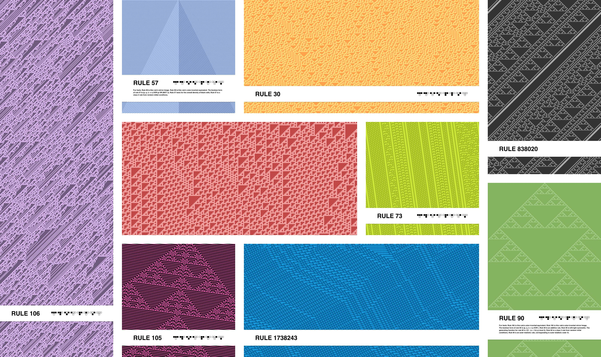

# cellular-automata-posters

Simple Python script that **generates cellular automata posters as PDF** files.

Heavily inspired by [this Reddit post](https://www.reddit.com/r/cellular_automata/comments/6bg60e/2d_cellular_automata_posters/) – **all credit goes to /u/collatz_conjecture**, while any criticism is to be [directed at me](https://github.com/doersino).


## Examples



You can find the associated PDF files in the `examples/` subdirectory.


## Setup & Usage

The script has been tested with Python 3 and uses the [`cairocffi` package](https://pypi.python.org/pypi/cairocffi) to draw vector shapes to PDF. That package, in turn, depends on CFFI, Cairo and other system-dependent libraries. **Take a look at the [`cairocffi` documentation](http://cairocffi.readthedocs.io/en/latest/overview.html#installing-cffi)** to get started. Further, the [`wolframalpha` package](https://pypi.python.org/pypi/wolframalpha) is used to display "fun facts" about the rules – the script contains a comment explaining how to get the Wolfram|Alpha AppID required to enable this feature.

If you're on macOS, you can run the following commands to set things up – that's what worked for me, anyway:

```bash
$ brew install python3 pkg-config libffi cairo
$ PKG_CONFIG_PATH=/usr/local/opt/libffi/lib/pkgconfig pip3 install cffi
$ pip3 install cairocffi
$ pip3 install wolframalpha
```

Now **adjust the settings in `cap.py` to taste** (they're explained inline, I encourage you to play around with them). Then run the script using

```
$ python3 cap.py
```

after which you'll find the generated PDF file in your working directory.


## Notes

* If **adjusting the settings in the source file feels icky** to you, you can **use environment variables**: Calling the script as `CAP_RULE=57 CAP_WIDTH=400 CAP_ANGLE=5.5 CAP_COLORSCHEME="('#478c49', '#d0c043')" CAP_GRIDMODE='None' CAP_FONT='PragmataPro' CAP_PAGEWIDTH=2000 CAP_DEBUG='True' CAP_FILENAME='optionOverrides.pdf' python3 cap.py` will use the values from the environment variables with all other options set to their defaults. The end result – if you can get a hold of the [PragmataPro font](https://www.fsd.it/shop/fonts/pragmatapro/) – will look like [this](examples/optionOverrides.pdf).
* You can also run `export CAP_FONT='Times'` before running the script multiple times (potentially for multiple rules). That way, the value (here: font) is set until you overwrite it or terminate the terminal session.
* The `utils/` subdirectory contains a few useful scripts, e.g. for generating the example image above. Also available is a LaTeX file that combines multiple PDFs into one, only showing a slice of each – this might come in handy for color proof printing.
* There are several ways of dealing with the edges of the grid. One of the more common approaches (especially for 2D automata) seems to be to let the grid warp around the edges, i.e. the right neighbor of the right-most cell is the left-most cell and vice versa. That's what I went with for now.
* Possible **improvements or additions** are being kept track of in a section at the bottom of this file.
* Even though the script is licensed under the MIT license which permits commercial use, **it'd be cool if you refrain from selling copies of the posters for profit**. Note that **/u/collatz_conjecture [has licensed](https://www.reddit.com/r/cellular_automata/comments/6qchx5/python_script_generating_1d_cellular_automata/dkxg3n1/) the original poster designs under the [CC BY-NC-SA 3.0 US license](https://creativecommons.org/licenses/by-nc-sa/3.0/us/)**, so please follow these terms when redistributing the generated PDF files.
* Want to find out more in-depth info about this kind of cellular automaton? Read [Stephen Wolfram's paper](https://lainchan.jp/tech/src/1497017334945.pdf).
* Cellular automata [occur in nature](https://www.reddit.com/r/cellular_automata/comments/2ivi13/cellular_automata_shells/), which is kinda cool.
* I recommend using the excellent [`pdf2svg` utility](http://www.cityinthesky.co.uk/opensource/pdf2svg/) if you for some reason prefer the results in SVG. File sizes can get quite large, however: around 10-40 MB for each of the examples shown above.
* Originally, I planned to implement this poster generator in LuaLaTeX and Ti*k*Z (because that's what I was familiar with). Turns out that drawing close to a million Ti*k*Z nodes ain't so fast, so I quickly abandoned that approach and went the Python route. If I'd felt a little more ambitions, I likely would've tried Haskell instead.


## Future Work

* [ ] Add photo of printed posters (once I actually get mine printed).
* [ ] Improve fun facts wording. Most of them could be computed without relying on Wolfram|Alpha, however getting the simplified boolean form, categorizing the rules into classes and getting the other "Properties" might be tricky (of course, that could just be hardcoded for rules 0-255 as it seems to be on Wolfram|Alpha, but that's no fun).
* [ ] Improve label rendering code by moving all magic numbers to variables and making margins, border widths, font size etc. customizable. Also use drawn height of rule text and description (`context.text_extents` function) for vertical positioning – this would make sure that the vertical margins are correct for any font.
* [ ] Write an equivalent script for Conway's Game of Life (possibly vertically stacked states viewed 3D-ish from the side?) and/or Langton's Ant.
* [ ] Consider supporting continuous 1D automata: https://bitbucket.org/antonio_rt/1d-continuous-cellular-automata

You're very welcome to send a pull request implementing one or more of the above (or [file an issue](https://github.com/doersino/cellular-automata-posters/issues) if you have any other ideas for improvement)!
